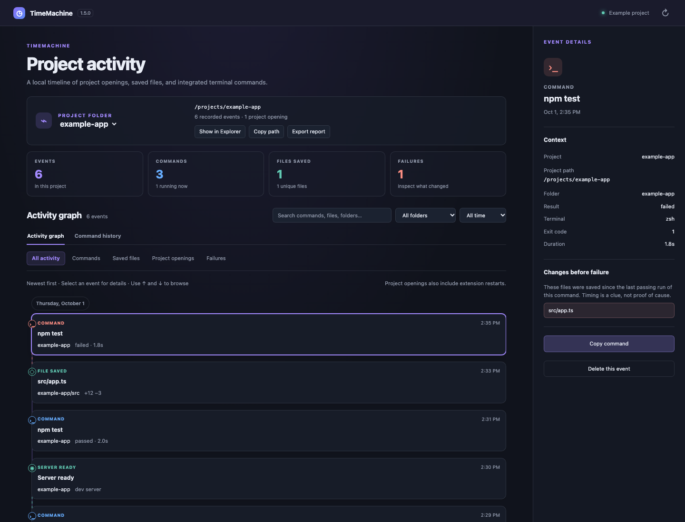
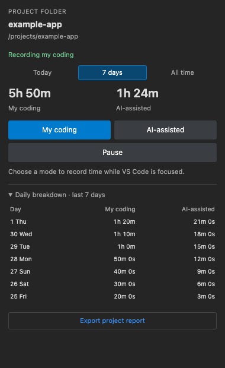
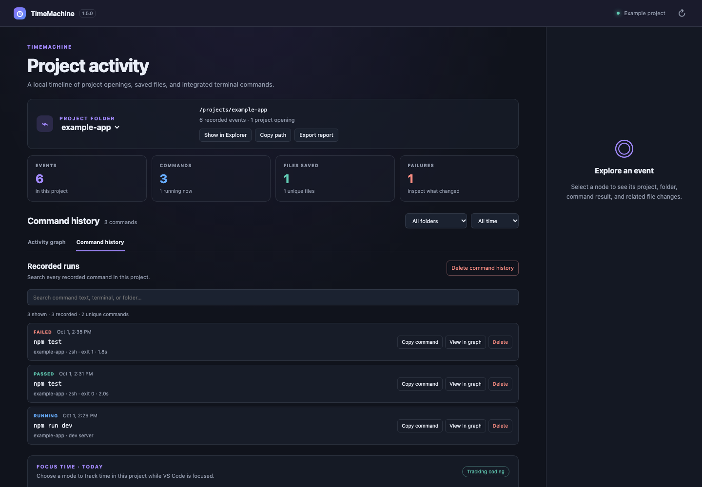

# TimeMachine — Your project's flight recorder

See what happened between a passing test or build and a later failure. TimeMachine also keeps local command history, file saves, checkpoints, and coding time in one project timeline.

[Install from the VS Code Marketplace](https://marketplace.visualstudio.com/items?itemName=itstushar.timemachine) · [Getting started](docs/getting-started.md) · [Report a bug](https://github.com/TusharAnand303/timemachine_vscode/issues/new/choose)

**Free to use · VS Code 1.93+ · No account required · Preview release**

TimeMachine helps you answer practical questions: What did I work on? Which command failed? What changed since it last passed? How much time did I label as my own coding or AI-assisted work?

*Product screenshots use illustrative data from an example project.*

## Coding time, directly in the sidebar

Choose **My coding** or **AI-assisted** in the **Coding Time** panel. Switch modes as you work, pause when finished, and review **Today**, **7 days**, or **All time**. Expand the daily breakdown to see both modes for each of the past seven calendar days.

The timer counts while the VS Code window is focused. It pauses while unfocused and starts paused after reloading VS Code. Modes are labels you select; TimeMachine does not detect AI authorship of individual edits.

## Searchable terminal command history

Find an earlier command by its text, folder, terminal, or result. See running, passed, failed, and unknown results, with exit codes and duration where available. **Copy command** retrieves the command text. **View in graph** brings its surrounding project activity into view.

Commands must run in a shell-integrated terminal inside an open project. Start a new integrated terminal after installation. External terminals and commands run before activation are not captured.

## Inspect the changes before a failure

Run a test or build such as `npm test`, `npm run build`, `pytest`, `phpunit`, or `go test` in a shell-integrated terminal. A successful run becomes **Last Known Good**. If a later run of the same command fails, TimeMachine offers **What Changed?** and **Open Timeline**. The report ranks recorded file saves and file operations, counts saves per file, and shows terminal commands, dependency installs, configuration and lockfile changes, and Git branch changes between the two runs.

Select a failed command to see files saved since the previous passing run of that command in the same project. Compare available before/after snapshots or restore an earlier version into the editor for review. Without an earlier passing run, TimeMachine suggests the latest preceding save.

Dashed links are timing clues, rather than proof of the cause. [Try the repeatable failure example](docs/failure-investigation.md).

Use **TimeMachine: Create Checkpoint** to save up to 200 eligible source files locally, then **TimeMachine: Compare With Checkpoint** to open a built-in VS Code diff for a chosen file. **TimeMachine: Show Session Summary** reports activity since this extension session started, including tests/builds, passes/failures, checkpoints, current branch, and the latest Last Known Good.

## Project context and local activity reports

The sidebar and graph show the opened folder's name and full path. Browse nested project folders, filter activity by folder or time range, and use the arrow keys to browse events. Older opening records also show the current project folder name; newer records explain whether the folder was added or the extension started with it open.

Export the selected project's retained activity and daily coding totals as **JSON** or **CSV**, directly from the sidebar, graph, or Command Palette. Reports contain command text and paths; saved source contents and snapshot files are excluded. Report export is independent of the graph's current filters.

## Get started in three steps

1. Install **TimeMachine**, open a project folder, and select the TimeMachine clock in the Activity Bar.
2. In **Coding Time**, select **My coding** or **AI-assisted**. Save a text file and run a command in a new integrated terminal inside the project.
3. Select the graph icon above **Project Timeline** to inspect activity. Use **Command history** to find past runs or **Export report** to save your project report.

To install the local release, open **Extensions → … → Install from VSIX**, choose `releases/timemachine-1.6.0.vsix`, and reload VS Code. [Detailed setup](docs/getting-started.md).

## Useful commands

| Command Palette action | Use it to |
| --- | --- |
| TimeMachine: Open Activity Graph | Inspect project events and saved changes |
| TimeMachine: Search Command History | Find and copy a recorded command |
| TimeMachine: What Changed? | Compare the latest failed check with its previous pass |
| TimeMachine: Create Checkpoint | Save a bounded local source snapshot |
| TimeMachine: Compare With Checkpoint | Diff a checkpoint file against its current version |
| TimeMachine: Show Session Summary | Review this extension session |
| TimeMachine: Start Coding Timer | Start a My coding session |
| TimeMachine: Start AI-Assisted Timer | Start an AI-assisted session |
| TimeMachine: Pause Coding Timer | Stop recording focus time |
| TimeMachine: Export Project Activity Report | Save a JSON or CSV report |
| TimeMachine: Check Setup | Diagnose project and shell integration setup |

## Privacy and practical limits

TimeMachine stores its records in VS Code's extension storage. It does not upload your activity, add analytics, require an account, or create Git commits. Remote-workspace storage follows the extension host. [Read the data and privacy details](docs/privacy.md).

- Up to **500 events** are retained across the workspace, with text snapshots for saved files up to **512 KiB**. The latest successful check for each recorded command is favored during pruning.
- Checkpoints capture up to **200 files**, each at most **64 KiB**, with a **2 MiB** total limit. They include saved disk contents.
- Focus-time totals are stored separately and survive timeline event pruning.
- Restore updates the editor buffer; review and save it yourself.
- Timers count focused window time, including reading or thinking, rather than keyboard activity.
- Reports are local exports; importing reports as a timeline backup is not supported.

## Frequently asked questions

**Does TimeMachine automatically track AI coding?**

You select My coding or AI-assisted. It tracks the time spent in the mode you choose while VS Code is focused; it does not analyze edits or connect to an AI provider.

**Why are my commands missing?**

Use a new integrated terminal inside an open project. Run **TimeMachine: Check Setup** and check [terminal shell integration troubleshooting](docs/troubleshooting.md).

**Does this replace Git?**

TimeMachine records local activity and available saved-file snapshots. It does not create commits, import Git history, or provide a backup service.

**Can I clear my recorded history?**

The graph offers confirmed deletion for an event, a project's commands, or all activity and time totals for that project. Project source files are not deleted.

**Is it open source?**

The repository is public, and the unmodified extension is free to use. Modification and redistribution require permission under the [source license](LICENSE).

## Support and development

[Report a bug or request a feature](https://github.com/TusharAnand303/timemachine_vscode/issues/new/choose) · [Troubleshooting](docs/troubleshooting.md) · [Development guide](docs/development.md) · [Changelog](CHANGELOG.md) · [Publishing](PUBLISHING.md)
